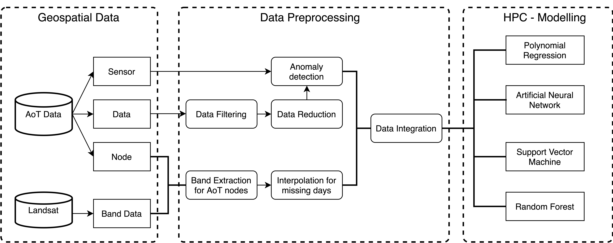

# Notebook for Deep Learning Approach for Predicting Urban Heat Island Effects with High-frequency Urban Sensing Data

### Author: Fangzheng Lyu
### Contact: flu8@illinois.edu

This repo includes notebooks used in the study of Deep Learning Approach for Predicting Urban Heat Island Effects with High-frequency Urban Sensing Data.

The flowchart of this reserch is shown below:

## Data

### 1. AoT data

You can follow the guide to batch download of AoT data with waggle: https://github.com/waggle-sensor/waggle/blob/master/data/README.md

### 2. Landsat data

Landsat data used in this reseach can be found in: https://earthexplorer.usgs.gov/

Please specify the timerange in the summer of 2018-2020, Chicago area, and Landsat 8.

### 3. Intermediate data

If you don't want to run the whole thing and wish to have intermediate result to run the modelling part directly, please contact Fangzheng Lyu with flu8@illinois.edu

## Data Preprocessing

### 1. Data filtering & Data reduction

Those two step are conducted with waggle data tool at: https://github.com/waggle-sensor/data-tools

Specifically, data fitering are done with slice_data_range funciton and the data reduction are conducted with data-reduction-tool function

### 2. Anomly Detection

### 3. Band extract

Landsat_processing.ipynb is used to do band extraction from remote sensing data

### 4. Interpolation for missing data & Data Integration

data_formatting.ipynb is used to do interpolation for remote sensing data

Missing_Data.ipynb is used to fill in missing value with miceforest: Fast Imputation with Random Forests method.

## Model

### 1. Polynomial Regression

Regression.ipynb

### 2. SVM

SVM.ipynb

### 3. ANN

ann_MAE.ipynb for evaluating with MAE

ann_MSE.ipynb for evaluating with MSE

### 4. Random Forest Regression

RF.ipynb

## Final Heatmap Visualization data generation

Heatmap_ANN.ipynb and Heatmap_RF.ipynb are used to generate the data used for the heatmap visualization. 

